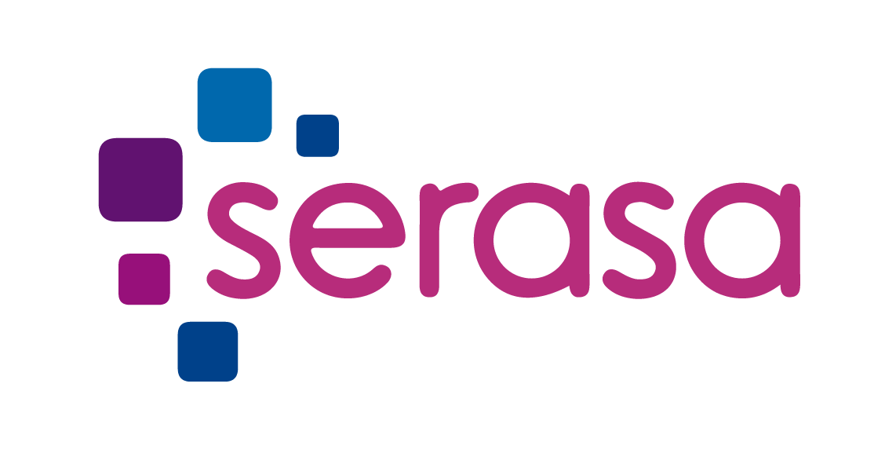

<h1 align="center">
    
</h1>

# Challenge Serasa

Challenge for New Developers Program.

## Installation

Use the package manager [npm](https://www.npmjs.com/) to install this project.

```bash
npm install
```

## Usage

```zsh
npm run dev

```

## Build

```zsh
npm run build

```

## Tests

```bash
npm run test

```

## Author

**Arthur Wagenknecht** 👤

* Github: [@oarthurdev](https://github.com/oarthurdev)
* LinkedIn: [https:\/\/www.linkedin.com\/in\/arthurwagen\/](https://linkedin.com/in/https:\/\/www.linkedin.com\/in\/arthurwagen\/)

## Show your support
Give a ⭐️

***

## License
[MIT](https://choosealicense.com/licenses/mit/)